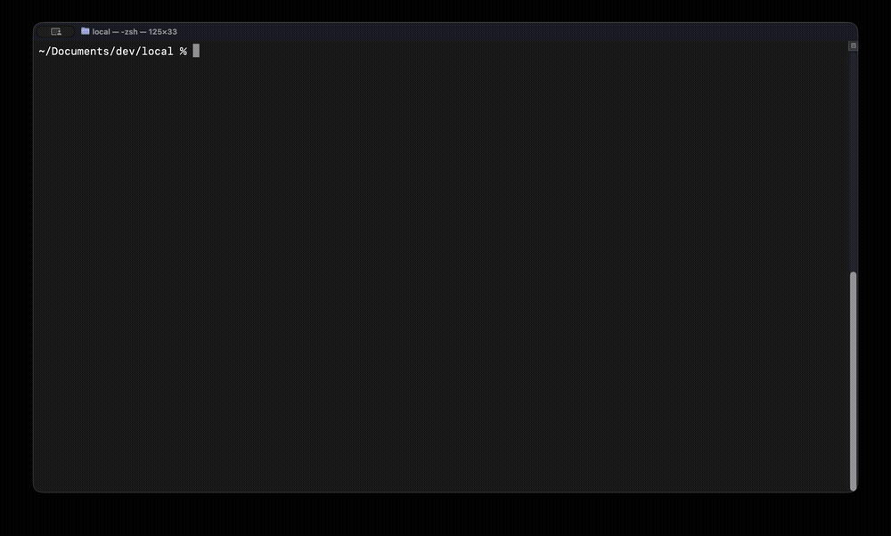

# PocketLantern

[](https://github.com/pocketlantern/pocketlantern/actions/workflows/ci.yml)
[](LICENSE)
[](https://nodejs.org)
[](https://pocketlantern.dev)

**Your AI agent sounds confident. It missed the blockers.**

Prices shift, versions break, licenses change. PocketLantern surfaces the pipeline-checked constraints your AI agent doesn't know about — before they become production incidents.



## What it catches

### Auth vendor lock-in

Ask: "Which auth provider — Clerk, Auth0, or Cognito?"

Without PocketLantern:

> "It depends on your team size and requirements."

With PocketLantern:

```
⚠️ Cognito password hashes are permanently non-exportable
⚠️ Auth0 password export requires support ticket — Free tier excluded
⚠️ Auth0 Rules/Hooks EOL 2026-11-18 — Actions not portable
✅ Clerk has the most flexible migration path
```

### Breaking upgrade

Ask: "Should I upgrade to Next.js 16?"

Without PocketLantern:

> "Turbopack is default now. Use the codemod and upgrade."

With PocketLantern:

```
⚠️ Sync API access fully removed — all dynamic calls must be awaited
⚠️ Custom webpack config breaks next build
⚠️ next lint removed — switch to Biome or ESLint CLI
⚠️ Requires Node.js 20.9.0+, TypeScript 5.1.0+, React 19.0+
✅ Plan phased migration — codemod doesn't cover webpack or middleware
```

### Hard deadline

Ask: "Can I use the OpenAI Realtime API?"

Without PocketLantern:

> "GA is available. Use gpt-4o-realtime-preview."

With PocketLantern:

```
⚠️ gpt-4o-realtime-preview removed 2026-05-07
⚠️ Beta interface (realtime=v1 header) removed same date
⚠️ GA event schema incompatible — 4 event renames
✅ Start on GA from day one — or plan dual-stack migration
```

Three questions. Three blocker types. Same AI, different facts.

## How it works

PocketLantern is an MCP server. Your AI agent calls `search_cards` — and gets pipeline-checked decision cards **plus blocker warnings** from bundled sidecar blocker edges (where indexed).

```
Agent asks question
  -> search_cards("clerk vs auth0 authentication")
  -> 3 cards + 5 blocker warnings (lock-in, EOL, export restrictions)
  -> Agent answers with pipeline-checked constraints
```

Local cardset. Instant lookup. No vector database. No embeddings. Keyword search, card links, and sidecar blocker edges where bundled. The value is in **source-linked, pipeline-checked cards**, not clever retrieval alone.

```
search_cards("auth", constraints:["serverless"]) -> cards + blockers
get_card("auth/clerk-vs-auth0-vs-cognito-2026")  -> full card with facts
get_related_cards(...)                           -> connected topics
```

## Quick start

**Prerequisites**: Node.js >= 22, [pnpm](https://pnpm.io/installation) (`npm i -g pnpm`), an MCP client ([Claude Code](https://docs.anthropic.com/en/docs/claude-code), [Cursor](https://cursor.com), etc.)

```bash
git clone https://github.com/pocketlantern/pocketlantern.git
cd pocketlantern && pnpm install && pnpm build
```

> The first `pnpm install` may show a bin-link warning — this is harmless and resolves after `pnpm build`.

**v1 public essentials** (what we promise, what we don't, install, issues, Free vs Pro, refresh semantics): [docs/v1-public.md](docs/v1-public.md).

### Claude Code

```bash
npx pocketlantern init
```

`init` registers the MCP server in `~/.claude.json` **and** adds a one-line rule to your project's `CLAUDE.md`. Restart Claude Code (`Ctrl+C`, then run `claude` again), then ask your first query.

### Cursor / Windsurf / other MCP clients

Add to your MCP config (Cursor: `~/.cursor/mcp.json`):

```json
{
  "mcpServers": {
    "pocketlantern": {
      "command": "node",
      "args": ["/absolute/path/to/toolkit/apps/mcp-server/dist/server.js"]
    }
  }
}
```

Then add this line to your project rules (`.cursorrules`, Kiro steering file, etc.):

```
For technology decisions, upgrades, migrations, or licensing questions: before finalizing your answer, check the PocketLantern MCP server's search_cards tool for blockers in this cardset snapshot — your training data may be stale.
```

Reload MCP servers: Cursor — `Cmd+Shift+P` -> "MCP: Restart Servers". Windsurf — restart the editor.

### Try these queries

Ask your AI agent:

1. **"Which auth provider — Clerk, Auth0, or Cognito?"**
   Cognito password hashes permanently locked, Auth0 export requires support ticket, Clerk most flexible

2. **"Should I upgrade to Next.js 16?"**
   4 simultaneous breaking changes, webpack config breaks build, Node.js 20.9.0+ required

3. **"Can I use the OpenAI Realtime API?"**
   Beta + preview model removed 2026-05-07, GA event schema incompatible

4. **"How did Vercel pricing change with Fluid Compute?"**
   Billing split to Active CPU + Memory, shared-process concurrency breaks isolation

5. **"Prisma or Drizzle for Edge/serverless?"**
   Prisma v7 ESM + driver adapter breaking, Edge preview-only; Drizzle 0.30-1.0 also breaking

Blocker warnings appear in MCP responses when your AI agent calls `search_cards` with blocker data. The CLI `search` command shows matched cards; full blocker detail is delivered through the MCP tool in your AI agent.

### Verify installation

```bash
npx pocketlantern doctor               # check installation status
npx pocketlantern search "auth pricing" # search cards from CLI
```

## Local mode & connected mode

**Local mode** (available now) — 100+ curated blocker-aware cards across 25 categories ship with this repo. Works immediately, no network, no account.

**Connected mode** (coming soon) — planned hosted retrieval will extend local mode with additional curated decision cards. Local cards always ship with this repo; connected mode adds more coverage when available.

## What's included

100+ curated blocker-aware cards across 25 categories — plus sidecar blocker edges from the bundled graph index:

| Card                                                                                                                               | Blocker it catches                                                     |
| ---------------------------------------------------------------------------------------------------------------------------------- | ---------------------------------------------------------------------- |
| [Clerk vs Auth0 vs Cognito](knowledge/cards/auth/clerk-vs-auth0-vs-cognito-2026.yaml)                                              | Cognito password hash permanent lock-in, Auth0 export restriction      |
| [Next.js 16 Upgrade](knowledge/cards/frontend/nextjs-16-upgrade-turbopack-default-and-async-request-apis.yaml)                     | 4 breaking changes, webpack build failure, middleware deprecation      |
| [OpenAI Realtime API Migration](knowledge/cards/ai/openai-realtime-api-beta-to-ga-migration-before-february-27-2026-shutdown.yaml) | Beta removed, GA event schema incompatible                             |
| [Vercel Fluid Compute](knowledge/cards/serverless/vercel-fluid-compute-vs-classic-functions-cost-and-concurrency-2026.yaml)        | Billing model change, shared-process concurrency, classic opt-out      |
| [Prisma vs Drizzle](knowledge/cards/database/prisma-vs-drizzle-for-edge-and-serverless.yaml)                                       | Prisma v7 ESM breaking, Edge preview-only, Drizzle timestamp change    |
| [Supabase vs Firebase](knowledge/cards/backend/supabase-vs-firebase-baas-pricing-and-features-2026.yaml)                           | Edge Functions lock-in, auth.uid() not portable, pg_dump safe          |
| [GitHub Actions Node24](knowledge/cards/devtools/github-actions-node24-migration-after-node20-deprecation-2026.yaml)               | Node20 EOL Apr 2026, macOS 13.4 incompatibility                        |
| + more                                                                                                                             | Auth provider migration, Supabase vs Firebase, SSO vendor lock-in, ... |

### What a card looks like

Each card is a structured YAML file with source-linked facts and official reference links:

```yaml
id: auth/clerk-vs-auth0-vs-cognito-2026
title: Clerk vs Auth0 vs Cognito Under Current Pricing and Feature Changes
problem: Select an auth vendor given recent pricing shifts, MAU economics, ...
constraints: [cost-sensitive, low-ops, enterprise, compliance, serverless]
candidates:
  - name: Clerk
    summary: "Pro starts at $20/mo, includes 50,000 MRUs per app..."
    when_to_use: "Choose for small-team + low-ops + cost-sensitive SaaS..."
    tradeoffs: "Best DX and fastest implementation..."
    cautions: "Be precise about org-member limits..."
    links:
      - https://clerk.com/pricing
      - https://clerk.com/docs/guides/organizations/configure
  - name: Auth0
    # ...
  - name: Amazon Cognito
    # ...
tags: [auth, clerk, auth0, pricing, passkeys, b2b, compliance]
related_cards: [auth/sso-for-b2b-saas, auth/rbac-vs-abac-vs-rebac]
updated: 2026-03-14
```

See [packages/schema/src/card.ts](packages/schema/src/card.ts) for the full schema definition.

## Project structure

```
toolkit/
  packages/schema/       <- Card schema (zod + TypeScript types)
  apps/mcp-server/       <- MCP server (search, retrieval, tool handlers)
  apps/cli/              <- CLI (validate, search, init, doctor)
  knowledge/cards/       <- Decision cards (25 categories)
  docs/                  <- User guides & roadmap
```

**Monorepo**: pnpm workspace. Build order: `schema -> mcp-server -> cli`.

## Development

```bash
pnpm build              # Build all packages
pnpm test               # Run tests (295 tests)
pnpm test:coverage      # Run with coverage report
pnpm lint               # ESLint
pnpm format:check       # Prettier check
```

## Contributing

Contributions to the tool (schema, MCP server, CLI, search) are welcome. See [CONTRIBUTING.md](CONTRIBUTING.md) for guidelines.

## License

[MIT](LICENSE)
